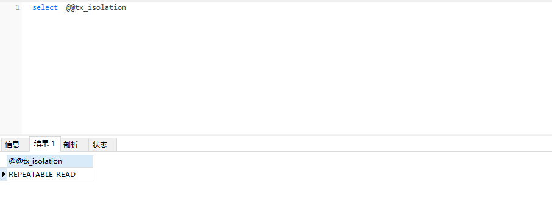

## 数据库事务面临的问题：

### 脏读

事务A在t1时刻更新了数据，然后事务B在t2时刻读取了数据，但是此时事务A并未结束, A在t3时刻回滚了更新的数据，所以事务B读取的数据就是脏读；

### 不可重复读

在同一个事务内，不同时刻读取同一数据的结果是不同的，一般是因为两次读取期间其他事务进行了插更新操作；

### 幻读

事务A对内容进行了更改，但是还未提交，这时事务B插入了与事务A更改前相同的数据，在事务A结束前进行查询的时候，仿佛事务A并未起作用一样。

## 设置数据库隔离级别

数据库隔离级别通过以下命令查看：

```sql
 select @@tx_isolation;
```



设置隔离级别：

```sql
SET [SESSION | GLOBAL] TRANSACTION ISOLATION LEVEL {READ UNCOMMITTED | READ COMMITTED | REPEATABLE READ | SERIALIZABLE}。
```

设置隔离级别Global只对以后新开的session有用，对当前的session无效，如果使用shell则需要重新连接，如果是Navicat则需要新建查询窗口

设置隔离级别Session对当前session有效


语法

读未提交 (read uncommitted)


读提交 (read committed)

可重复读 (repeatable read)

可序列化 (serializable)


解决

|      | 脏读 | 不可重复读 | 幻读 |
| ---- | ---- | ---- | ---- |
|  |      |      |      |
|      |      |      |      |
|      |      |      |      |
| | | | |

